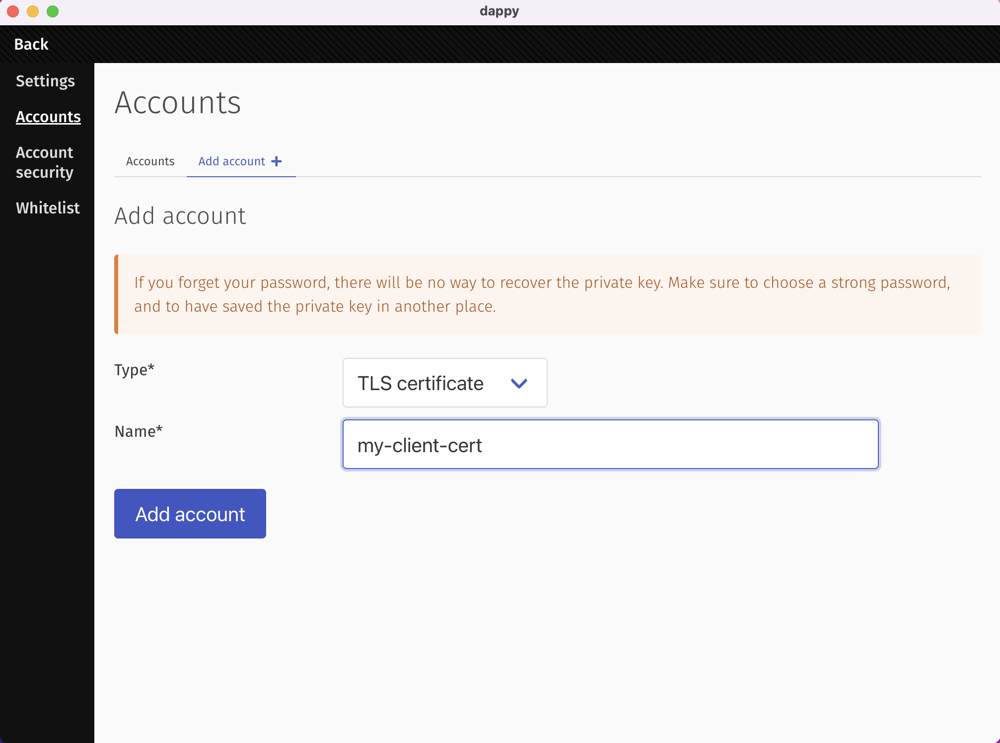
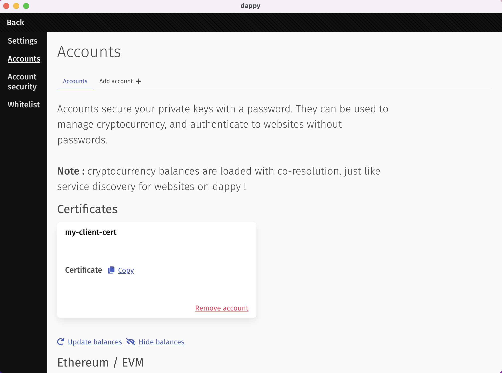
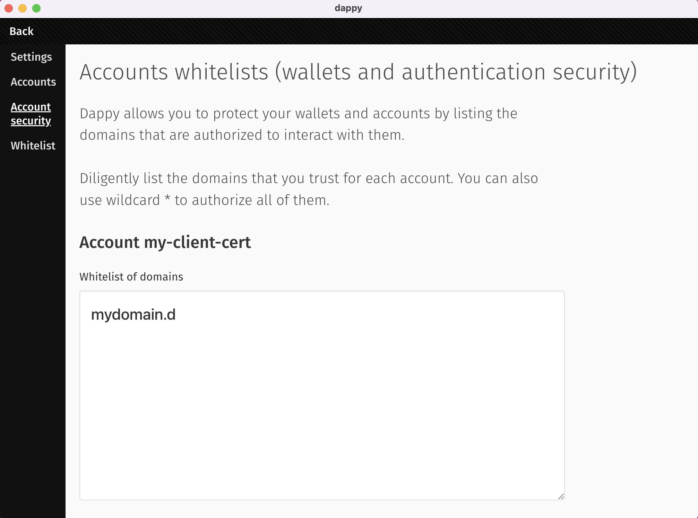

# Manage mTLS in dappy browser

## Create your own client certificate

Go to Settings > Accounts > Add account

Fill form like this:
- **Ttype:** `TLS certificate`
- **name:** `<your-client-certificate-name>`

Your client certificate is created and safely stored in dappy browser.

## Use a client certificate for a domain

Go to Settings > Add security

Add any domains you want to send your client certificate:
- 1 domain per line
- wildcards are accepted

